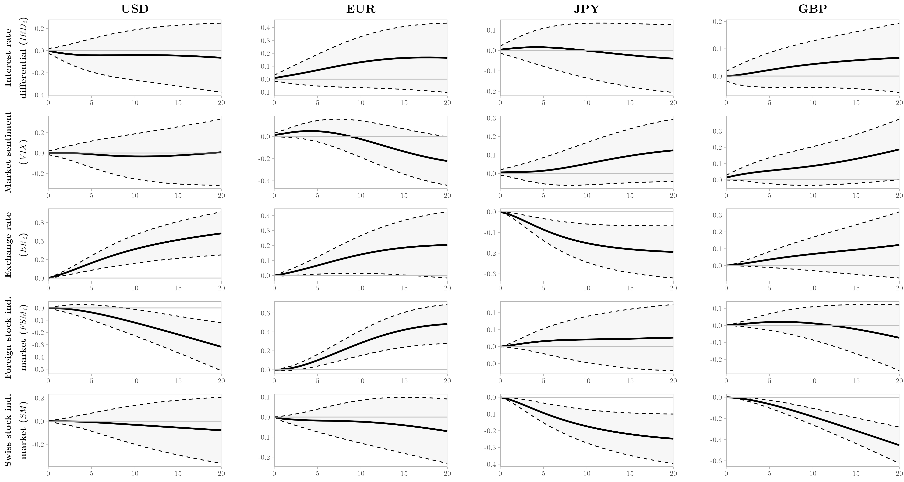
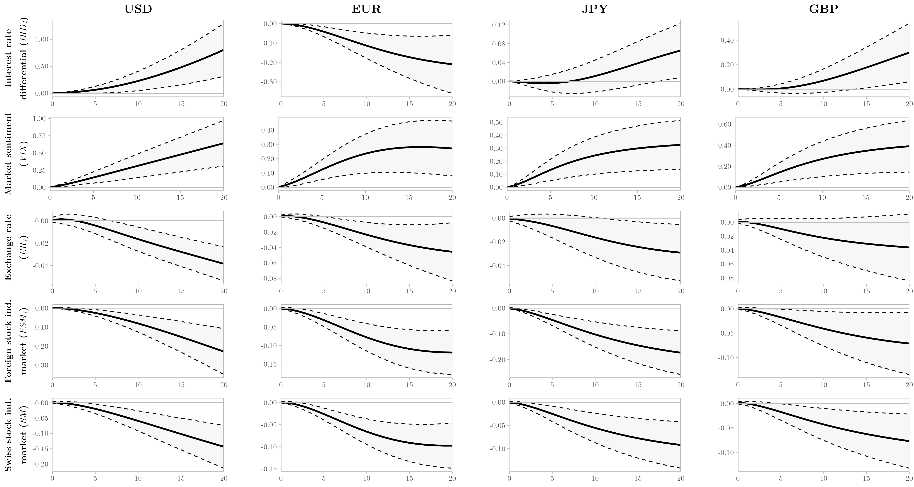

count: false

```{r setup, include=FALSE}
options(htmltools.dir.version = FALSE, htmltools.preserve.raw = FALSE)
library(dplyr)
library(kableExtra)
library(knitr)
```

```{r xaringan-themer, include = FALSE}
library(xaringanthemer)
style_xaringan()
mono_light(
  link_color = "#2541b2",
  base_color = "#000000",
  code_inline_color = "#2541b2",
  header_font_google = google_font("Josefin Sans"),
  text_font_google   = google_font("Montserrat", "300", "300i"),
  code_font_google   = google_font("Montserrat", "300", "300i"),
  title_slide_background_image = "all-ok.PNG",
  title_slide_background_size = "95%",
  title_slide_background_position = "bottom"
)
```

# Motivation

- International spillovers of negative interest rate policy (NIRP) is a **`very recent`** strand in the literature (e.g. Arteta, Kose, Stocker and Taskin 2016<sup>1</sup>)

- Twofold interest in the Swiss franc:

  1. In times of turmoil, it is a major **`safe haven currency`**. Overall, also a **`funding currency`** of carry trade activities.

  2. Due to the "interest rate bonus" (Kugler and Weder 2002<sup>2</sup>) and the NIRP, the impacts of the Swiss National Bank's actions resonate **`far beyond`** Switzerland

.footnote[<span style='font-size: 12px'>
[1] Arteta, Carlos, Ayhan Kose, Marc Stocker, and Temel Taskin. 2016. “Negative Interest Rate Policies: Sources and Implications.” *Policy Research Working Paper Series* 7791. The World Bank.<span style>
<br><span style='font-size: 12px'>[2] Kugler, Peter, and Beatrice Weder. 2002. “The Puzzle of the Swiss Interest Rate Island: Stylized Facts and a New Interpretation.” *Aussenwirtschafhet* 57 (01): 49–64.
<span style>]

- Lack of **`robust`** empirical papers analyzing the **`pervasive effects`** of the carry trade activity

???

> The carry trade is the name of the strategy of going  short  (betting  the  foreign  exchange value will fall) in a low-interest rate currency like  the  Japanese  yen,  while  simultaneously going  long  (betting  the  foreign  exchange value will rise) in a high-interest rate currency like the New Zealand dollar.

> --- Frankel (2008)

---

# What do we do?

In the context of the NIRP in Switzerland...

- We use data from hedge funds to **`investigate the behavior`** of the Swiss franc carry trade

  + Four major currencies: US dollar, euro, Japanese yen, and British pound
  
  + Disentangle the **`funding currency`** and **`safe haven`** effects
  
- Our Swiss franc carry trade proxy allows the investigation of different target currencies (**`bilateral analysis`**)

  + **`Volume`** approach using **`weekly`** CFTC data (**`non-commercial`** traders), based on Fong (2013)<sup>3</sup>
  
  + Uncovered interest rate parity (UIP), impact on asset prices, and systemic risk

.footnote[<span style='font-size: 12px'>
[3] Fong, Wai Mun. 2013. “Footprints in the Market: Hedge Funds and the Carry Trade.” *Journal of International Money and Finance* 33 (March): 41–59.<span style>]

---

# What do we find?

Using **`all available data`** at the time (Dec 23, 2014 to Nov 24, 2020), excluding the selection bias...

- Major findings:

  + Distinctive behavior for the Swiss franc as **`funding`** and **`safe have`** currency

  + The UIP is **`violated`** for the USD, EUR and JPY models
  
  + Hedge funds **`are able`** to move asset prices
  
  + An **`increased systemic risk`** is linked to a higher Swiss franc carry trade activity

---

count: false

class: inverse, center, middle

# Data and SVAR model

---

```{r Table1, echo=FALSE, message=FALSE, warning=FALSE}

df <- data.frame(Variables = c("\\(IRD_i\\)", "\\(VIX^{*}\\)", "\\(CT_i\\)", "\\(SM^{*}\\)", "\\(ER_i^{*}\\)", "\\(FSM_i^{*}\\)"),
                 Text_1 = c("Interest rate differential using the 12-Month London Interbank Offered Rate (LIBOR) and spot (LIBOR) rates for target currencies (USD, EUR, JPY, and GBP)",
                            "Market sentiment: CBOE DJIA Volatility Index",
                            "Net position of Swiss franc-funded carry trade by target currencies, following Fong (2013)",
                            "Domestic stock market: Swiss Market Index ^SSMI",
                            "Nominal exchange rates (cross rates): USD/CHF, EUR/CHF, CHF/JPY, GBP/CHF",
                            "Foreign stock markets: USD - S&P 500 (^GSPC), EUR - EURONEXT 100 (^N100), JPY - Nikkei 225 (^N225), GBP - FTSE 100 (^FTSE)"),
                 Text_2 = c("FRED", "FRED", "CFTC", "BIS", "Yahoo Finance", "Yahoo Finance"))

df %>%
  mutate(
    Variables = cell_spec(Variables, "html", font_size = "medium", escape = F)
  ) %>%
  kable("html", caption = "Table 1. Description of variables", linesep = "", align = "clc", escape = F,
  col.names = c("Variable", "Definition", "Source")) %>%
  kable_styling(full_width = F) %>%
  row_spec(0:0, align = "c") %>%
  row_spec(0, color = "white", background = "black")
```

$*$ In logarithmic form.

--

- Yahoo Finance data was obtained and checked/cleaned with `r icons::fontawesome$brands$"r-project"` packages `quantmod` and `BatchGetSymbols`. Overall, the problem with this source is related to individual stocks, **`not indices`**. 

---

# CFTC data

- Some **`caveats`**: 

> I. Bias in the classification of the traders

> II. Trades identified as speculative may not result from carry trades

> III. Only a small proportion of foreign exchange market activity is executed through exchanges (mostly OTC)

> --- Galati, Heath and McGuire (2007)<sup>3</sup>

- As mentioned by **`market participants`**, CFTC data tends to be indicative of the **`trend`** of carry trade activity (Bank for International Settlements 2015)<sup>4</sup>.

.footnote[
<span style='font-size: 12px'>[3] Galati, G., A. Heath and P. McGuire (2007), ‘Evidence of carry trade activity’, *BIS Quarterly Review*.<span style>
<span style='font-size: 12px'>[4] Bank for International Settlements (2015), *Currency Carry Trades in Latin America*, Bank for International Settlements.<span style>
]

---

# Econometric model

- Structural vector-autoregressive (**`SVAR`**) model with Cholesky identification

  + Ordering: <span style=" font-size: medium;" > $IRD_{i}$ $\rightarrow$ $VIX$ $\rightarrow$ $CT_{i}$ $\rightarrow$ $ER_{i}$ $\rightarrow$ $FSM_{i}$ $\rightarrow$ $SM$ </span>
  
--

- Toda-Yamamoto approach to capture **`long-term effects`** (non-stationary variables stay in **`levels`**)

```{r Table2, echo=FALSE, message=FALSE, warning=FALSE}

tab2 <- data.frame(Text_0 = c("USD", "EUR", "JPY", "GBP"),
                 Text_1 = c("2", "2", "1", "1"),
                 Text_2 = c("\\(VIX_{t-3}\\), \\(CT_{USD,t-3}\\),
                            \\(ER_{USD,t-3}\\), \\(FSM_{USD,t-3}\\),
                            \\(SM_{t-3}\\)",
                            "\\(VIX_{t-3}\\), \\(CT_{EUR, t-3}\\),
                            \\(ER_{EUR, t-4}\\), \\(FSM_{EUR, t-3}\\),
                            \\(SM_{t-3}\\)",
                            "\\(VIX_{t-2}\\), \\(CT_{JPY,t-2}\\),
                            \\(ER_{JPY,t-2}\\), \\(FSM_{JPY,t-2}\\),
                            \\(SM_{t-2}\\)",
                            "\\(VIX_{t-2}\\), \\(CT_{GBP,t-2}\\),
                            \\(SM_{t-2}\\)"))

tab2 %>%
  mutate(
    Text_2 = cell_spec(Text_2, "html", font_size = "small", escape = F)
  ) %>%
  kable("html", caption = "Table 2. Exogenous variables for each model", booktabs = T, escape = F, align = "c", 
  col.names = c("Model", "VAR lag length (\\(p)\\)", "Exogenous variables"), position = "!ht") %>%
  kable_styling(font_size = 16, full_width = F) %>%
  row_spec(0:0, align = "c") %>%
  row_spec(0, color = "white", background = "black")
```

--

- Selection of the VAR lag length follows a **`step-wise approach`**: unit-root tests and Lagrange-multiplier (LM) test for residual autocorrelation

--

  + **`Robustness checks`**: **`(1)`** different ordering, based on Granger causality tests, **`(2)`** non-stationary model, **`(3)`** model with time dummies, and **`(4)`** model excluding the carry trade proxy

---

count: false

class: inverse, center, middle

# Results for the Impulse Response Functions (IRFs)

---

class: center

<span style='font-size: 16px'>**Swiss franc carry trade activity `is impacted`...**<span style>
```{r, cache=FALSE, echo=FALSE}

```
.center[<span style='font-size: 12px'>Figure 1. Cumulative structural carry trade (*CT*) responses to variables impulses in each model<span style>]

--

```{r Table3, echo=FALSE, message=FALSE, warning=FALSE}

tab3 <- data.frame(Variables = c("Target currency", "\\(IRD_i\\)", "\\(VIX\\)", "\\(ER_i\\)", "\\(FSM_i\\)", "\\(SM\\)"),
                 Text_1 = c("USD", "", "", "+", "-", ""),
                 Text_2 = c("EUR", "", "", "+", "+", ""),
                 Text_3 = c("JPY", "", "", "-", "", "-"),
                 Text_4 = c("GBP", "", "", "", "", "-")) %>%
  mutate(
    Variables = cell_spec(Variables, "html", font_size = 12, escape = F),
    Text_1 = cell_spec(Text_1, "html", font_size = 12, escape = F),
    Text_2 = cell_spec(Text_2, "html", font_size = 12, escape = F),
    Text_3 = cell_spec(Text_3, "html", font_size = 12, escape = F))

tab3 <- as.data.frame(t(tab3))
colnames(tab3) <- tab3[1,]
tab3 <- tab3[-1,]
rownames(tab3) <- NULL

tab3[1,4] <- cell_spec(tab3[1,4], "html", escape = F, color = "white", background = "green")
tab3[1,5] <- cell_spec(tab3[1,5], "html", escape = F, color = "white", background = "red")

tab3[2,4] <- cell_spec(tab3[2,4], "html", escape = F, color = "white", background = "green")
tab3[2,5] <- cell_spec(tab3[2,5], "html", escape = F, color = "white", background = "green")

tab3[3,4] <- cell_spec(tab3[3,4], "html", escape = F, color = "white", background = "red")

tab3[3:4,6] <- cell_spec(tab3[3:4,6], "html", escape = F, color = "white", background = "red")

tab3 %>%
  kable("html", escape = F, align = "c",position = "!ht") %>%
  kable_styling(font_size = 12, full_width = F, bootstrap_options = "condensed") %>%
  row_spec(0:0, align = "c") %>%
  row_spec(0, color = "white", background = "black") %>%
  row_spec(c(2,4), background = "#E5E5E5") %>%
  row_spec(1:4, bold = T)
```

---

class: center

<span style='font-size: 16px'>**`An increased` Swiss franc carry trade activity...**<span style>
```{r, cache=FALSE, echo=FALSE}

```
.center[<span style='font-size: 12px'>Figure 2. Cumulative structural variables responses to carry trade (*CT*) impulses in each model<span style>]

--

```{r Table4, echo=FALSE, message=FALSE, warning=FALSE}

tab4 <- data.frame(Variables = c("Target currency", "\\(IRD_i\\)", "\\(VIX\\)", "\\(ER_i\\)", "\\(FSM_i\\)", "\\(SM\\)"),
                 Text_1 = c("USD", "+", "+", "-", "-", "-"),
                 Text_2 = c("EUR", "-", "+", "-", "-", "-"),
                 Text_3 = c("JPY", "-", "+", "-", "-", "-"),
                 Text_4 = c("GBP", "-", "+", "", "-", "-")) %>%
  mutate(
    Variables = cell_spec(Variables, "html", font_size = 12, escape = F),
    Text_1 = cell_spec(Text_1, "html", font_size = 12, escape = F),
    Text_2 = cell_spec(Text_2, "html", font_size = 12, escape = F),
    Text_3 = cell_spec(Text_3, "html", font_size = 12, escape = F))

tab4 <- as.data.frame(t(tab4))
colnames(tab4) <- tab4[1,]
tab4 <- tab4[-1,]
rownames(tab4) <- NULL

tab4[1,2] <- cell_spec(tab4[1,2], "html", escape = F, color = "white", background = "green")
tab4[2:4,2] <- cell_spec(tab4[2:4,2], "html", escape = F, color = "white", background = "red")
tab4[1:4,3] <- cell_spec(tab4[1:4,3], "html", escape = F, color = "white", background = "green")
tab4[1:3,4] <- cell_spec(tab4[1:3,4], "html", escape = F, color = "white", background = "red")
tab4[1:4,5] <- cell_spec(tab4[1:4,5], "html", escape = F, color = "white", background = "red")
tab4[1:4,6] <- cell_spec(tab4[1:4,6], "html", escape = F, color = "white", background = "red")

tab4 %>%
  kable("html", escape = F, align = "c",position = "!ht") %>%
  kable_styling(font_size = 12, full_width = F, bootstrap_options = "condensed") %>%
  row_spec(0:0, align = "c") %>%
  row_spec(0, color = "white", background = "black") %>%
  row_spec(c(2,4), background = "#E5E5E5") %>%
  row_spec(1:4, bold = T)
```

---

count: false

class: inverse, center, middle

# Results for the Granger causality tests using the Toda-Yamamoto approach

---

class: center

<span style='font-size: 16px'>**Swiss franc carry trade activity `is Granger-caused by`...**<span style>
```{r TableGC2, echo=FALSE, message=FALSE, warning=FALSE}
GC2 <- structure(list(c("\\(IRD_i\\)", "\\(VIX\\)", "\\(ER_i\\)", "\\(FSM\\)", 
"\\(SM\\)", "\\(All\\) \\(variables\\)"), `\\(CT_{USD}\\)` = c("0.0483**  ", "0.9823    ", 
"0.0015*** ", "0.8945    ", "0.9624    ", "0.0311**  "), `\\(CT_{EUR}\\)` = c("0.7511    ", 
"0.2604    ", "0.1818    ", "0.3664    ", "0.3845    ", "0.5404    "
), `\\(CT_{JPY}\\)` = c("0.9286    ", "0.4740    ", "0.0241**  ", 
"0.1994    ", "0.0787*   ", "0.3112    "), `\\(CT_{GBP}\\)` = c("0.0558*   ", 
"0.5320    ", "0.0002*** ", "0.0034*** ", "0.2506    ", "0.0097*** "
)), class = "data.frame", row.names = c(NA, -6L))

kable(GC2, "html", booktabs = T, linesep = "", align = "lcccccc", position = "!ht", escape = F)  %>%
  kable_styling(font_size = 16, full_width = F) %>%
  row_spec(0, color = "white", background = "black")
```

<span style='font-size: 16px'>**Swiss franc carry trade activity `Granger-causes`...**<span style>
```{r TableGC1, echo=FALSE, message=FALSE, warning=FALSE}
GC1 <- structure(list(c("\\(CT_{USD}\\)", "\\(CT_{EUR}\\)", "\\(CT_{JPY}\\)", "\\(CT_{GBP}\\)"
), `\\(IRD_i\\)` = c("0.1881    ", "0.0810*   ", "0.5202    ", 
"0.8517    "), `\\(VIX\\)` = c("0.0217**  ", "0.0600*   ", "0.0395**  ", 
"0.0300**  "), `\\(ER_i\\)` = c("0.3625    ", "0.0648*   ", "0.7120    ", 
"0.1296    "), `\\(FSM_i\\)` = c("0.0656*   ", "0.0281**  ", "0.0017*** ", 
"0.0931*   "), `\\(SM\\)` = c("0.0442**  ", "0.0169**  ", "0.0255**  ", 
"0.0442**  ")), row.names = c(NA, -4L), class = "data.frame")

kable(GC1, "html", booktabs = T, align = "lcccccc", position = "!ht", escape = F)  %>%
  kable_styling(font_size = 16, full_width = F) %>%
  row_spec(0, color = "white", background = "black")
```

Both tables show the p-value of the test for the `absence of Granger causality`. Null hypothesis is that one variable `does not` Granger-cause the other variable. \*\*\*, \*\*, and \* denote statistical significance at 1%, 5%, and 10%, respectively.

---

count: false

class: inverse, center, middle

# Concluding remarks

---

- The paper extends the carry trade literature by investigating empirically the effects of the Swiss NIRP 

--

- Swiss franc carry trade is explored with four target currencies ($, €, ¥, £)

--

- **`Funding`** currency

  + CHF depreciation increases CT (all models but GBP)
  + Higher FSM impacts positively CT (EUR)
  + UIP failure, where CT impacts ER (USD, EUR and JPY)
  + Higher CT appreciates the CHF (USD and EUR)

--

- **`Safe haven`** currency

  + Higher FSM impacts negatively CT (USD)
  + Higher SM impacts negatively CT (JPY and GBP)
  + Higher CT depreciates the CHF (JPY)
  + Higher CT increases VIX (all models)
  
--

- Additionally, for **`all models`**, there is also evidence that CT **`increases systemic risk`** (higher CT increases VIX) and **`moves asset prices`** (higher CT increases FSM and SM)

---

count: false

class: inverse, center

<br><br><br><br><br><br><br>

.center[
# Thank you!
```{r icon-style, echo=FALSE, include=FALSE}
library(icons)
icon1 <- icon_style(fontawesome("cog", style = "solid"), size = 1, animate = "spin", fill = "white")

icon2 <- icon_style(fontawesome("twitter", style = "brands"), size = 1, fill = "white")
```

`r icon1` [**`bttomio@furb.br`**](bttomio@furb.br)

`r icon2` [**`@bttomio`**](https://twitter.com/bttomio)
]

<br><br><br>Slides created with [`xaringan`](https://github.com/yihui/xaringan) and [`xaringanthemer`](https://github.com/gadenbuie/xaringanthemer).

<br>