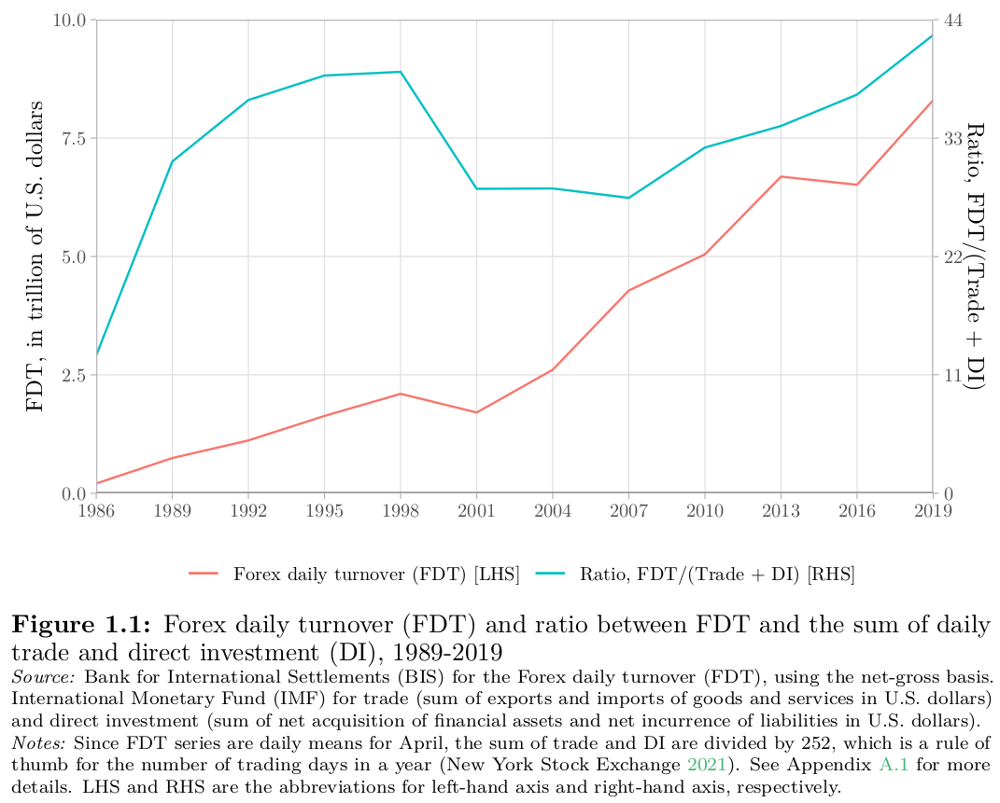
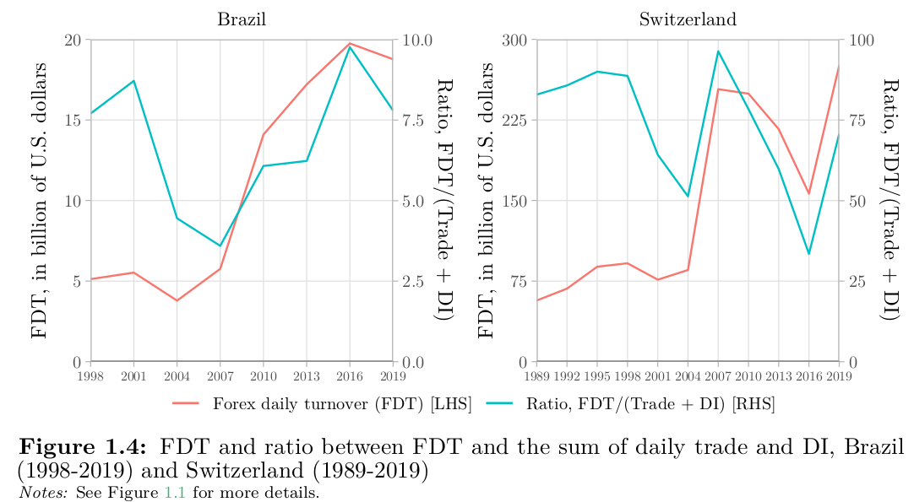
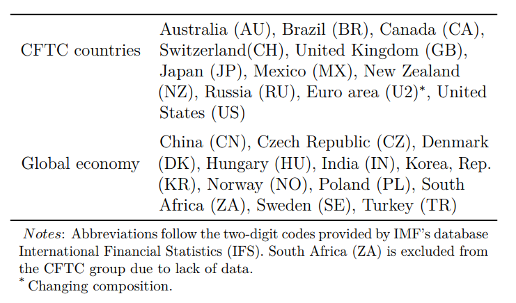
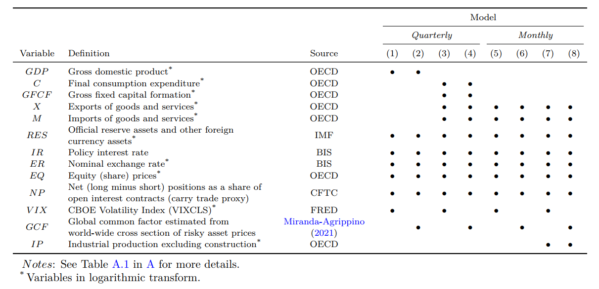
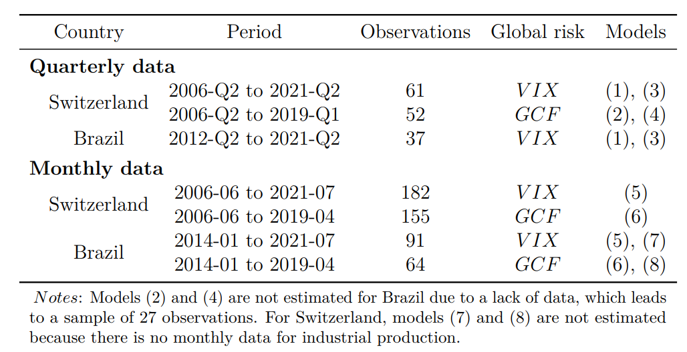
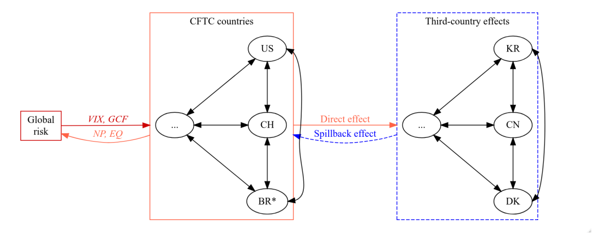
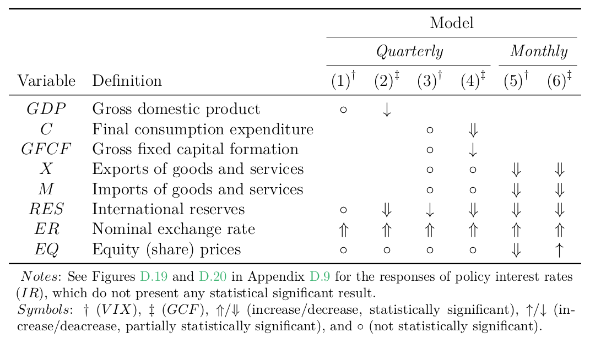
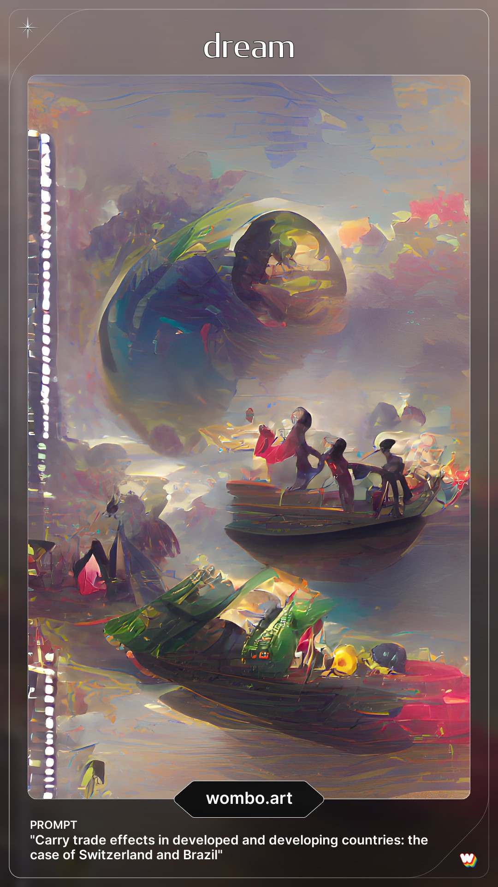

```{r setup, include=FALSE}
options(htmltools.dir.version = FALSE, htmltools.preserve.raw = FALSE)
library(dplyr)
library(kableExtra)
library(knitr)
```

```{r xaringan-themer, include = FALSE}
library(xaringanthemer)
style_xaringan()
mono_light(
  link_color = "#2541b2",
  base_color = "#000000",
  code_inline_color = "#2541b2",
  header_font_google = google_font("Josefin Sans"),
  text_font_google   = google_font("Montserrat", "300", "300i"),
  code_font_google   = google_font("Montserrat", "300", "300i"),
  title_slide_background_image = "all-ok.PNG",
  title_slide_background_size = "95%",
  title_slide_background_position = "bottom"
)
```

```{r xaringanExtra, echo=FALSE}
xaringanExtra::use_xaringan_extra(c("tile_view", "animate_css", "tachyons"))
```

count: false

class: inverse, center, middle

# General introduction

---

# Financialization of FX markets

```{r, cache=FALSE, echo=FALSE, out.width="80%", fig.align='center'}

```

---

# Two key currencies involved

```{r, cache=FALSE, echo=FALSE, out.width="100%"}

```

---

# Lack of empirical studies

```{r, cache=FALSE, echo=FALSE, out.width="100%"}
knitr::include_graphics("./Motivation-3.png")
```

---

class: center, middle

# <span style="color:#2541b2; font-weight: bold"> How does carry trade impact the real economy activity?</span>

---

count: false

class: inverse, center, middle

# Research design

---

# Carry trade definition

- No generally accepted 

--

- Borrowing and investing (canonical)

--

- In this thesis, the carry trade is 

  + Leveraged

--

  + Futures market

--

  + Short (funding) and Long (target)

---

# Methodology

- Holism as the core

--

- Epistemology rooted in 
  
  + Realism

--

  + Skepticism

--

  + Empiricism

--

  + Principle of parsimony 

--

```{r iconR, echo=FALSE, include=FALSE}
library(icons)
#download_simple_icons() # AFTER FIRST INTALL
iconR <- icon_style(simple_icons("r"), size = 2)
```

- Reproducible research 

  + `r iconR` (manuscript, presentation and econometric procedures)
  
  + Check https://github.com/bttomio/UGA_thesisdown

---

# Data

- Volume approach, instead of prices 

--

- Weekly CFTC data

--

- Best public data

--

- Limitations

  + Small proportion

--

  + Classify traders, not activity
  
--

  + Short data range for Brazil

---

# Main results

---

# Empirical approach [I]

- World economy is proxied with 21 countries and the Euro area (84% of global nominal output)

<span style='font-size: 22px; font-weight: bold'>Country coverage</style>
```{r, cache=FALSE, echo=FALSE, out.width="80%", fig.align='center'}

```

---

# Empirical approach [II]

- Monthly and quarterly models (roughly)

- Two measures of global risk

<span style='font-size: 22px; font-weight: bold'>List of variables</style>
```{r, cache=FALSE, echo=FALSE, out.width="100%", fig.align='center'}

```

---

# Empirical approach [III]

<span style='font-size: 22px; font-weight: bold'>Time span for each model</style>
```{r, cache=FALSE, echo=FALSE, out.width="80%", fig.align='center'}

```

---

# Empirical approach [IV]

- Bayesian global vector autoregressive model (BGVAR)

--

- Negative carry trade effects in both countries (main hypothesis)

<span style='font-size: 22px; font-weight: bold'>GVAR setup with global risk modelled separately</style>
```{r, cache=FALSE, echo=FALSE, out.width="100%", fig.align='center'}

```

---

# Main results [Switzerland]
<span style='font-size: 22px; font-weight: bold'> **`Negative shock on carry trade`**</style>

```{r, cache=FALSE, echo=FALSE, out.width="80%", fig.align='center'}

```

---

# Main results [Brazil]
<span style='font-size: 22px; font-weight: bold'> **`Positive shock on carry trade`**</style> 

```{r, cache=FALSE, echo=FALSE, out.width="80%", fig.align='center'}
knitr::include_graphics("./Ch4-BR.png")
```

---

count: false

class: inverse, center, middle

# General conclusion

---

# Final remarks

- In general, this article **`contributes to a better understanding`** of the carry trade effects in developed and developing countries (notably, Switzerland and Brazil)

--

- By making all econometric procedures **`reproducible`**, there is a contribution for **`enhanced transparency and ethics`** in Economics

--

- The **`macro-financial linkages`** remain a field widely open for new developments, wherein this article aimed to contribute on exploring the carry trade

--

- Central banks...

  + need more research to **`tame the negative spillovers`** of monetary policy

--

  + could **`follow`** the CFTC to create better datasets on futures market

---

# Future research on carry trade

- Further investigation on the monetary policy spillovers (e.g. add unemployment)

--

- Political economy approach, as conducted by Gabor on repo markets (2016) and Ban and Gabor on shadow banking (2016)

--

- Functional distribution of income and monetary policy and social responsibility of central banks, in line with Elgar Edward's book series edited by Vallet, Rochon and Kappes (2022)

--

- Microstructure and regulation, following Perry Mehrling's Money View 

---

count: false

class: inverse, center

.pull-left[
<br>
# Thank you!
# Obrigado!
```{r icon-style, echo=FALSE, include=FALSE}
library(icons)
#download_fontawesome() # AFTER FIRST INTALL
icon1 <- icon_style(fontawesome("cog", style = "solid"), size = 1, animate = "spin", fill = "white")

icon2 <- icon_style(fontawesome("twitter", style = "brands"), size = 1, fill = "white")
```

`r icon1` [**`bttomio@furb.br`**](bttomio@furb.br)

`r icon2` [**`@bttomio`**](https://twitter.com/bttomio)
]

.pull-right[
```{r, cache=FALSE, echo=FALSE, out.width="80%"}

```
]

