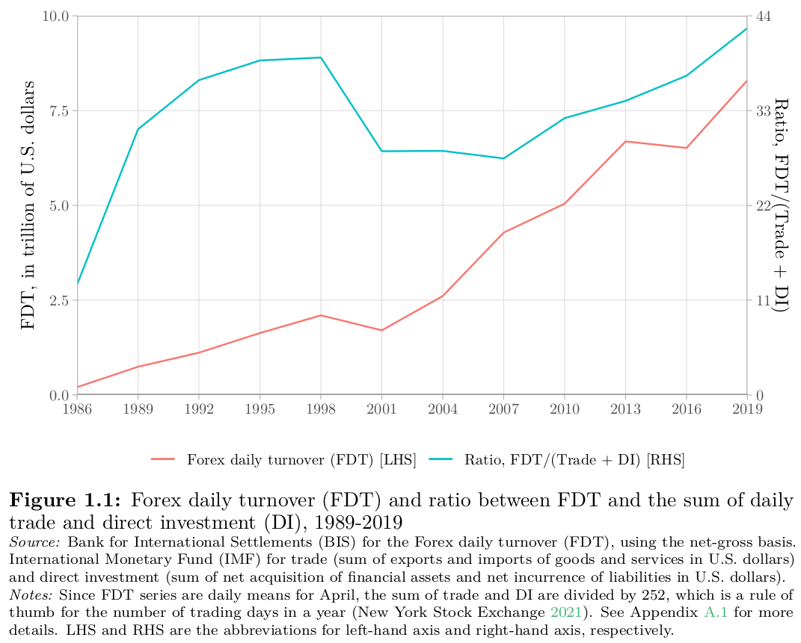
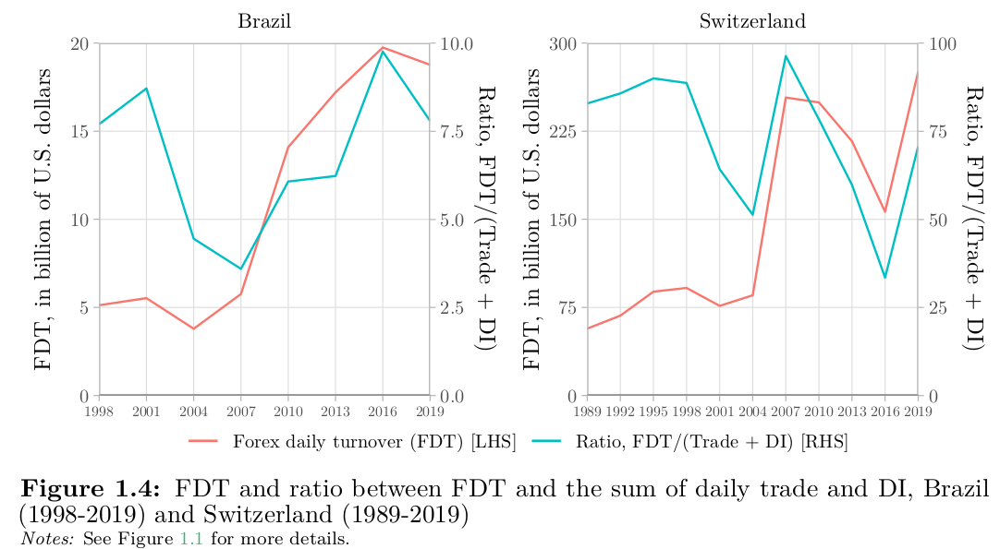
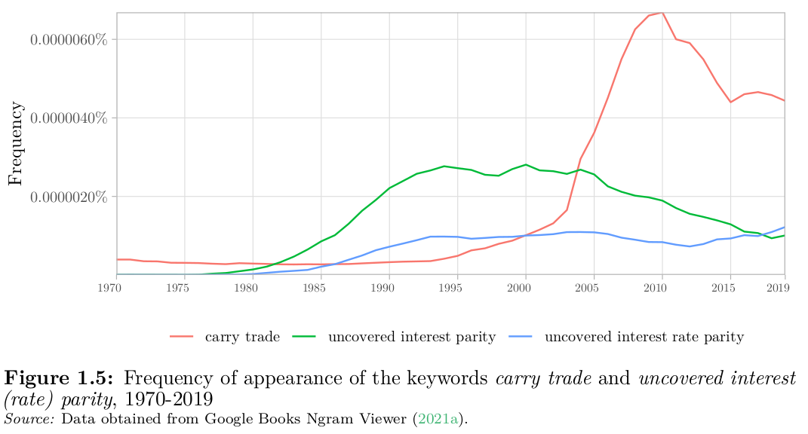
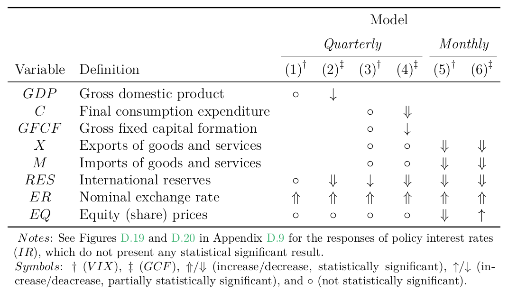
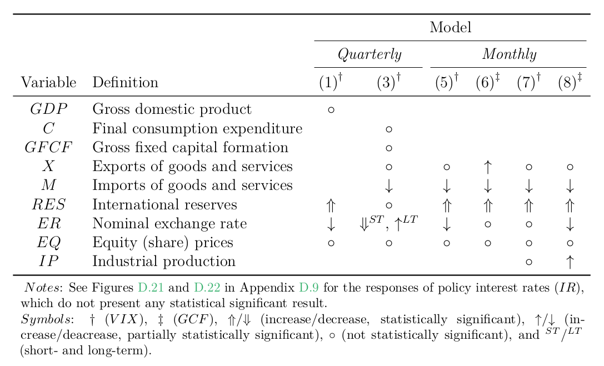
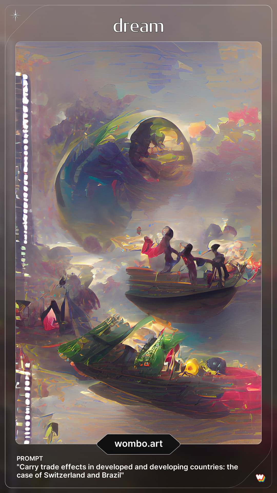

```{r setup, include=FALSE}
options(htmltools.dir.version = FALSE, htmltools.preserve.raw = FALSE)
library(dplyr)
library(kableExtra)
library(knitr)
```

```{r xaringan-themer, include = FALSE}
library(xaringanthemer)
style_xaringan()
mono_light(
  link_color = "#2541b2",
  base_color = "#000000",
  code_inline_color = "#2541b2",
  header_font_google = google_font("Josefin Sans"),
  text_font_google   = google_font("Montserrat", "300", "300i"),
  code_font_google   = google_font("Montserrat", "300", "300i"),
  title_slide_background_image = "all-ok.PNG",
  title_slide_background_size = "95%",
  title_slide_background_position = "bottom"
)
```

```{r xaringanExtra, echo=FALSE}
xaringanExtra::use_xaringan_extra(c("tile_view", "animate_css", "tachyons"))
```

count: false

class: inverse, center, middle

# General introduction

---

# Financialization of FX markets

```{r, cache=FALSE, echo=FALSE, out.width="80%", fig.align='center'}

```

---

# Two key currencies involved

```{r, cache=FALSE, echo=FALSE, out.width="100%"}

```

---

# Lack of empirical studies

```{r, cache=FALSE, echo=FALSE, out.width="100%"}

```

---

class: center, middle

# <span style="color:#2541b2; font-weight: bold"> How does carry trade impact the real economy activity?</span>

---

count: false

class: inverse, center, middle

# <span style="color:#2541b2; font-weight: bold"> Chapter 1</span> <br/> Research design

---

# Carry trade definition

- No generally accepted 

--

- Borrowing and investing (canonical)

--

- In this thesis, the carry trade is 

  + Leveraged

--

  + Futures market

--

  + Short (funding) and Long (target)

---

# Methodology

- Core is a mix of 

  + Reductionism (Chapters 2 and 3) 
  
  + Holism (Chapter 4)

--

- Epistemology rooted in 
  
  + Realism

--

  + Skepticism

--

  + Empiricism

--

  + Principle of parsimony 

--

- Reproducible research 

  + Stata (Chapters 2 and 3)
  
  + R (Chapter 4 and manuscript/presentation)

---

# Data

- Volume approach, instead of prices 

--

- Weekly CFTC data

--

- Best public data

--

- Limitations

  + Small proportion

--

  + Classify traders, not activity
  
--

  + Short data range for Brazil

---

# Structure

- Three papers/articles (could be read separately)

--

- Inspired on (data and carry trade measure)

  + **`Chapter 2.`**, Nishigaki (2007)

--

  + **`Chapter 3.`**, Fong (2013)

--

  + **`Chapter 4.`**, Brunnermeier, Nagel, and Pedersen (2008)

--

- My own development as an economist

---

count: false

class: inverse, center, middle

# <span style="color:#2541b2; font-weight: bold"> Three articles</span> <br/> Overview and main results

---

# Chapter 2
<span style='font-size: 22px; font-weight: bold'> **`Carry trade in developing and developed countries`**</style> <br/> <span style='font-size: 16px; font-weight: bold'>**`A Granger causality analysis with the Toda-Yamamoto approach (Economics Bulletin, 2020)`**</style>

- Ten currencies

--

- Monetary easing and tightening in the U.S. (12/2008 - 06/2019)

--

- Granger causality with the Toda-Yamamoto approach (long-term relationship, carry trade | financial variables)

--

- Common evidence

  + Exchange rate as a carry trade predictor

--

  + Carry trade Granger causes market sentiment (systemic risk spillovers)

---

# Chapter 3
<span style='font-size: 22px; font-weight: bold'> **`Carry trade and negative interest rate policy in Switzerland`**</style> <br/> <span style='font-size: 16px; font-weight: bold'>**`Low-lying fog or storm? (with Guillaume Vallet | under review, JBF)`**</style>

- Swiss franc carry trade with $, €, ¥, and £ as targets (bilateral analysis)

--

- Period of negative interest rate policy (12/2014 - 11/2020)

--

- Structural vector-autoregressive (SVAR) model with Cholesky identification

--

- Main evidence of the franc as a 

1. **`funding`** currency

--

  + uncovered interest rate parity (UIP) does not hold (USD, EUR and JPY)

2. **`safe haven`** currency

--

  + Swiss franc carry trade responds positively to an increase in VIX (GBP)
  
--

- Hedge funds are able to move asset prices

--

- Higher Swiss franc carry trade activity contributes to an increased systemic risk

---

# Chapter 4
<span style='font-size: 22px; font-weight: bold'> **`The political economy of carry trade`**</style> <br/> <span style='font-size: 18px; font-weight: bold'>**`The real economy got carried away in Switzerland and Brazil`**</style>

- World economy is proxied with 21 countries and the Euro area (84% of global nominal output)

--

- Monthly and quarterly models (roughly)

  + Switzerland (2006 to 2021)
  
  + Brazil (2012 to 2021)

--

- Two measures of global risk

  + Market sentiment (VIX)
  
  + Global common factor (GCF), created by Miranda-Agrippino

--

- Bayesian global vector autoregressive model (BGVAR)

--

- Negative carry trade effects in both countries (main hypothesis)

---

# Chapter 4
<span style='font-size: 22px; font-weight: bold'> **`The political economy of carry trade`**</style> <br/> <span style='font-size: 18px; font-weight: bold'>**`The real economy got carried away in Switzerland and Brazil`**</style>

<span style='font-size: 30px; font-weight: bold'>Switzerland, negative shock on carry trade</style>
```{r, cache=FALSE, echo=FALSE, out.width="80%", fig.align='center'}

```

---

# Chapter 4
<span style='font-size: 22px; font-weight: bold'> **`The political economy of carry trade`**</style> <br/> <span style='font-size: 18px; font-weight: bold'>**`The real economy got carried away in Switzerland and Brazil`**</style>

<span style='font-size: 30px; font-weight: bold'>Brazil, positive shock on carry trade</style>
```{r, cache=FALSE, echo=FALSE, out.width="85%", fig.align='center'}

```

---

count: false

class: inverse, center, middle

# General conclusion

---

# Final remarks

- In general, this thesis **`contributes to a better understanding`** of the carry trade effects in developed and developing countries (notably, Switzerland and Brazil)

--

- By making all econometric procedures **`reproducible`**, there is a contribution for **`enhanced transparency and ethics`** in Economics

--

- The **`macro-financial linkages`** remain a field widely open for new developments, wherein this thesis aimed to contribute on exploring the carry trade

--

- Central banks...

  + need more research to **`tame the negative spillovers`** of monetary policy

--

  + could **`follow`** the CFTC to create better datasets on futures market

---

# Future research on carry trade

- Further investigation on the monetary policy spillovers (e.g. add unemployment)

--

- Political economy approach, as conducted by Gabor on repo markets (2016) and Ban and Gabor on shadow banking (2016)

--

- Functional distribution of income and monetary policy and social responsibility of central banks, in line with Elgar Edward's book series edited by Vallet, Rochon and Kappes

--

- Microstructure and regulation, following Mehrling's Money View 

---

count: false

class: inverse, center

.pull-left[
<br>
# Thank you!
# Merci !
# Obrigado!
```{r icon-style, echo=FALSE, include=FALSE}
library(icons)
icon1 <- icon_style(fontawesome("cog", style = "solid"), size = 1, animate = "spin", fill = "white")

icon2 <- icon_style(fontawesome("twitter", style = "brands"), size = 1, fill = "white")
```

`r icon1` [**`bttomio@furb.br`**](bttomio@furb.br)

`r icon2` [**`@bttomio`**](https://twitter.com/bttomio)
]

.pull-right[
```{r, cache=FALSE, echo=FALSE, out.width="80%"}

```
]

