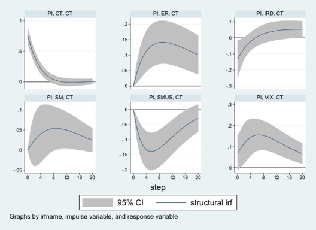
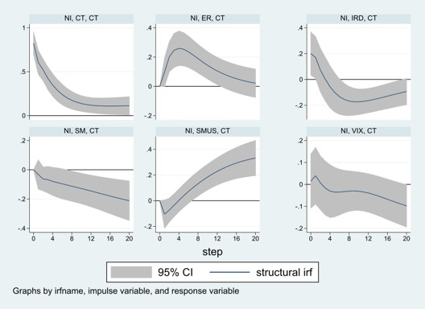
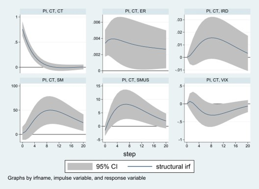
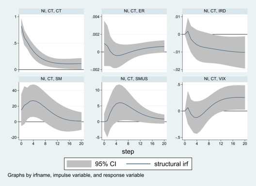

```{r setup, include=FALSE}
options(htmltools.dir.version = FALSE)
```

```{r xaringan-themer, include = FALSE}
library(xaringanthemer)
mono_light(
  link_color = "#64b9d3",
  base_color = "#000000",
  header_font_google = google_font("Josefin Sans"),
  text_font_google   = google_font("Montserrat", "300", "300i"),
  code_font_google   = google_font("Source Code Pro"),
  title_slide_background_image = "all-ok.PNG",
  title_slide_background_size = "95%",
  title_slide_background_position = "bottom"
)
```

# Definition of carry trade

> The carry trade is the name of the strategy of going  short  (betting  the  foreign  exchange value will fall) in a low-interest rate currency like  the  Japanese  yen,  while  simultaneously going  long  (betting  the  foreign  exchange value will rise) in a high-interest rate currency like the New Zealand dollar.

> --- Frankel (2008)<sup>1</sup>

.footnote[
[1] Frankel, J. (2008), 'Carried away: everything you always wanted to know about the carry trade, and perhaps much more', *Milken Institute Review*, 10(1), 38.
]

???

Start by giving a broad definition of carry trade.

---

class: center

#### **Figure 1** - CT ratio, US policy rate, and Switzerland’s policy rate

```{r F1, include=FALSE}
# GRAPH FOR THE PAPER (FIGURE 1)

library("readxl")
library("openxlsx")
library(dplyr)
library(ggplot2)

df <- read_excel("C:/Papier-Guillaume/LATEST DATA AND ESTIMATIONS/CTF/STATA - CHF.xls")

#DATA FOR THE GRAPH 1 (FIG. 1)

G1 <- dplyr::select(df, c(Date, NP, IR, USIR, PI, NI))

G1$Date <- as.Date(G1$Date)

names(G1)[names(G1) == "NP"] <- "CT"

gct <- ggplot(data=G1, aes(x=Date)) +
  geom_line(aes(y = CT, colour = "black"))+
  scale_x_date(date_labels = "%b-%y", date_breaks = "14 months", expand = c(0, 0))
gct <- gct + geom_line(aes(x=Date, y=IR*2, colour="red"))
gct <- gct + geom_line(aes(x=Date, y=USIR*2, colour="blue"))
gct <- gct + scale_y_continuous(breaks=seq(0,12,1), "Carry trade ratio (Short/Long)", 
                                sec.axis = sec_axis(~./2, name = "Interest rates (%)", breaks = seq(-0.75, 5.25, 0.75))) +
  scale_colour_manual("", values = c("black","blue", "red"), 
                      labels = c(
                        (expression(paste(italic("CT "), "(LHS)"))),
                        (expression(paste(italic("USIR "), "(RHS)"))),
                        (expression(paste(italic("IR "), "(RHS)")))))
gct <- gct + theme_light()
gct <- gct + theme(legend.position = c(.5, .83), legend.direction = "horizontal",
                   legend.background = element_rect(linetype="solid", 
                                 colour ="grey"),
                   panel.grid.major = element_blank(),
                   panel.grid.minor = element_blank())
rect <- data.frame(xmin=as.Date(c("2007-10-02")), xmax=as.Date(c("2019-11-12")), ymin=0, ymax=1)
gct <- gct + geom_rect(data=rect, aes(xmin=xmin, xmax=xmax, ymin=ymin, ymax=ymax),
                        color=NA,
                        fill="green4",
                        alpha=0.1,
                        inherit.aes = FALSE)
gct <- gct + labs(y = "Carry trade ratio (Short/Long)")
rect2 <- data.frame(xmin=as.Date(c("2014-12-23")), xmax=as.Date(c("2019-11-12")), ymin=-Inf, ymax=Inf)
gct <- gct + geom_rect(data=rect2, aes(xmin=xmin, xmax=xmax, ymin=ymin, ymax=ymax),
                       color=NA,
                       fill="yellow",
                       alpha=0.1,
                       inherit.aes = FALSE)
gct <- gct + annotate(geom="text", x=as.Date("2017-08-23"), y=11, 
                      label="Negative interest rate (NI) period", color = "gold4")
gct <- gct + annotate(geom="text", x=as.Date("2010-08-23"), y=11, 
                      label="Positive interest rate (PI) period", color = "black")
```

```{r gct, echo=FALSE, fig.height=7, fig.width=10, fig.align='center'}
plot(gct)
```

---

class: center

#### **Table 1** - Description of variables

```{r Table1, echo=FALSE, message=FALSE, warning=FALSE}
library(kableExtra)

df <- data.frame(Variables = c("CT", "ER", "IRD", "VIX", "SM", "SMUS"),
                 Text_1 = c("Ratio of short positions over long positions (Short/Long) - noncommercial traders", 
                                "Nominal exchange rates, USDCHF", "Difference between the policy interest rate in 
                                Switzerland and the policy interest rate in the United States", "Market sentiment, CBOE 
                                DJIA Volatility Index", "Swiss Market Index, ^SSMI (Swiss stock market)", "S&P 500, 
                                ^GSPC (US stock market)"),
                 Text_2 = c("CFTC", "BIS", "BIS", "FRED", "Yahoo Finance", "Yahoo Finance"))
knitr::kable(df, "html", linesep = "", align = "clc",
  col.names = c("Variable", "Definition", "Source")) %>%
  kable_styling(full_width = F) %>%
  row_spec(0:0, align = "c") %>%
  row_spec(0, color = "white", background = "black")
```

---

# Caveats for using CFTC data

>First,  while  non-commercial  traders  are  generally  associated  with speculative  activity,  it  is  possible  that  some  commercial  traders  also  take speculative  positions.  

> Second,  the  trades  identified  as  speculative  may  not result  from  carry  trades. 

> Finally,  a  comparison  with  statistics  from  the  BIS Triennial  Central  Bank  Survey  of  Foreign  Exchange  and  Derivatives  Market Activity  shows  that  only  a  very  small  proportion  of  foreign  exchange  market activity is executed through exchanges.

> --- Galati et al. (2007)<sup>2</sup>

.footnote[
[2] Galati, G., A. Heath and P. McGuire (2007), ‘Evidence of carry trade activity’, *BIS Quarterly Review*.
]

???

As mentioned by market participants, CFTC data tends to be indicative of the trend of carry trade activity (Bank for International Settlements 2015)<sup>3</sup>.

.footnote[
[3] Bank for International Settlements (2015), *Currency Carry Trades in Latin America*, Bank for International Settlements.
]


---

# Aim of the paper

We address two questions, by comparing both PI and NI periods: 

The .blue[first] refers to the determination of the financial factors that hold important roles in explaining the Swiss franc carry trade.

--

.blue[Second], we reflect on the consequences of the unwind of Swiss franc carry trade activities. Specifically, we are interested in how carry trade shocks the related financial variables.

---

# .center[Methodology]

### Data specification

- CT ratio: weekly released (each Tuesday)

- Other variables: daily (Tuesday)

--

### Econometric method

- Structural vector-autoregressive (SVAR) model to infer strong causation

- Toda-Yamamoto approach to capture long-term effects and to avoid unit root testing biases

--

<br><br><br>
.right[*PDF, slides, dataset, and code (do-file, Stata) are available at* .highlight[[https://bttomio.github.io](https://bttomio.github.io)].]

---

# .center[Results]

### Forecast-error variance decompositions (FEVDs)

- How much of the carry trade fluctuations are explained by the financial variables?

### Graphics of impulse response functions (IRFs)

- How the carry trade responds to shocks in the financial variables?

- How the financial variables respond to shocks in the carry trade activity?

---

class: center

#### FEVDs - Responses of the .highlight[carry trade] to one std. dev. shocks 
```{css, echo=F}
    /* Table width = 100% max-width */

    .remark-slide table{
        width: 100%;
    }
```

```{r results="asis", echo=F}
cat("
<style>
caption {
      color: black;
      font-weight: bold;
      font-size: 1.0em;
    }
</style>
")
```

```{r Table1PI, echo=FALSE, message=FALSE, warning=FALSE}
library("readxl")
library("kableExtra")
library("dplyr")

tab1PI <- read.table("c:/Portfolio/my site/public/slides/Table1PI.csv", header = TRUE, sep = ";")

tab1PI [ , ] %>%
  mutate(
    Step = ifelse(Step > 200,
                cell_spec(Step, "html", color = "#64b9d3", bold = T, background = "black"),
                cell_spec(Step, "html", color = "black")),
    IRD = ifelse(IRD > 8,
                 cell_spec(IRD, "html", color = "#64b9d3", bold = T, background = "black"),
                 cell_spec(IRD, "html", color = "black")),
    VIX = ifelse(VIX > 8,
                 cell_spec(VIX, "html", color = "#64b9d3", bold = T, background = "black"),
                 cell_spec(VIX, "html", color = "black")),
    CT = ifelse(CT > 200,
                cell_spec(CT, "html", color = "#64b9d3", bold = T, background = "black"),
                cell_spec(CT, "html", color = "black")),
    ER = ifelse(ER > 8,
                cell_spec(ER, "html", color = "#64b9d3", bold = T, background = "black"),
                cell_spec(ER, "html", color = "black")),
    SMUS = ifelse(SMUS > 8,
                  cell_spec(SMUS, "html", color = "#64b9d3", bold = T, background = "black"),
                  cell_spec(SMUS, "html", color = "black")),
    SM = ifelse(SM > 8,
                cell_spec(SM, "html", color = "#64b9d3", bold = T, background = "black"),
                cell_spec(SM, "html", color = "black"))
  ) %>%
  select(Step, everything()) %>%
  kable("html", linesep = "", align = "c", caption = "PI period", escape = F) %>%
  row_spec(0, color = "white", background = "black")
```

--
<br>

```{r Table1NI, echo=FALSE, message=FALSE, warning=FALSE}
library("readxl")
library("kableExtra")

tab1NI <- read.table("c:/Portfolio/my site/public/slides/Table1NI.csv", header = TRUE, sep = ";")

tab1NI [ , ] %>%
  mutate(
    Step = ifelse(Step > 200,
                cell_spec(Step, "html", color = "#64b9d3", bold = T, background = "black"),
                cell_spec(Step, "html", color = "black")),
    IRD = ifelse(IRD > 8,
                 cell_spec(IRD, "html", color = "#64b9d3", bold = T, background = "black"),
                 cell_spec(IRD, "html", color = "black")),
    VIX = ifelse(VIX > 8,
                 cell_spec(VIX, "html", color = "#64b9d3", bold = T, background = "black"),
                 cell_spec(VIX, "html", color = "black")),
    CT = ifelse(CT > 200,
                cell_spec(CT, "html", color = "#64b9d3", bold = T, background = "black"),
                cell_spec(CT, "html", color = "black")),
    ER = ifelse(ER > 8,
                cell_spec(ER, "html", color = "#64b9d3", bold = T, background = "black"),
                cell_spec(ER, "html", color = "black")),
    SMUS = ifelse(SMUS > 8,
                  cell_spec(SMUS, "html", color = "#64b9d3", bold = T, background = "black"),
                  cell_spec(SMUS, "html", color = "black")),
    SM = ifelse(SM > 8,
                cell_spec(SM, "html", color = "#64b9d3", bold = T, background = "black"),
                cell_spec(SM, "html", color = "black"))
  ) %>%
  select(Step, everything()) %>%
  kable("html", linesep = "", align = "c", caption = "NI period", escape = F) %>%
  row_spec(0, color = "white", background = "black")
```

---

class: top

.center[.small[Structural Impulse Responses of CT]

.highlight[ The financial variables impact the carry trade... ]]

.pull-left[
.center[.small[Figure 2 - PI period]]
```{r, cache=FALSE, echo=FALSE}

```

```{r R1, echo=FALSE, message=FALSE, warning=FALSE}
library(kableExtra)

r1 <- data.frame(mathexpr = c("\\(+\\)", "\\(-\\)", "\\(+\\)"),
                 Text_1 = c("ER", "SMUS", "VIX"))
knitr::kable(r1, "html", align = "c",
  col.names = c(".small[Impact]", ".small[Shock/Impulse]"))%>%
  row_spec(0, color = "white", background = "black")
```

]

--

.pull-right[
.center[.small[Figure 3 - NI period]]
```{r, cache=FALSE, echo=FALSE}

```

```{r R2, echo=FALSE, message=FALSE, warning=FALSE}
library(kableExtra)

r2 <- data.frame(mathexpr = c("\\(+\\)", "\\(+\\)", "\\(-\\)", "\\(+\\)", "\\(-\\)"),
                 Text_1 = c("ER (0-12 weeks)", "IRD (1 week)", "IRD (12-20 weeks)", 
                            "SMUS (8-... weeks)", "SM (8-... weeks)"))
knitr::kable(r2, "html", align = "c",
  col.names = c(".small[Impact]", ".small[Shock/Impulse]"))%>%
  row_spec(0, color = "white", background = "black")
```

]

---

class: center

#### FEVDs - Responses of the .highlight[financial variables] to one std. dev. shocks 

```{css, echo=F}
    /* Table width = 100% max-width */

    .remark-slide table{
        width: 100%;
    }
```

```{r results="asis", echo=F}
cat("
<style>
caption {
      color: black;
      font-weight: bold;
      font-size: 1.0em;
    }
</style>
")
```

```{r Table2PI, echo=FALSE, message=FALSE, warning=FALSE}
library("readxl")
library("kableExtra")
library("dplyr")

tab2PI <- read.table("c:/Portfolio/my site/public/slides/Table2PI.csv", header = TRUE, sep = ";")

tab2PI [ , ] %>%
  mutate(
    Step = ifelse(Step > 200,
                cell_spec(Step, "html", color = "#64b9d3", bold = T, background = "black"),
                cell_spec(Step, "html", color = "black")),
    IRD = ifelse(IRD > 8,
                 cell_spec(IRD, "html", color = "#64b9d3", bold = T, background = "black"),
                 cell_spec(IRD, "html", color = "black")),
    VIX = ifelse(VIX > 8,
                 cell_spec(VIX, "html", color = "#64b9d3", bold = T, background = "black"),
                 cell_spec(VIX, "html", color = "black")),
    CT = ifelse(CT > 200,
                cell_spec(CT, "html", color = "#64b9d3", bold = T, background = "black"),
                cell_spec(CT, "html", color = "black")),
    ER = ifelse(ER > 8,
                cell_spec(ER, "html", color = "#64b9d3", bold = T, background = "black"),
                cell_spec(ER, "html", color = "black")),
    SMUS = ifelse(SMUS > 8,
                  cell_spec(SMUS, "html", color = "#64b9d3", bold = T, background = "black"),
                  cell_spec(SMUS, "html", color = "black")),
    SM = ifelse(SM > 8,
                cell_spec(SM, "html", color = "#64b9d3", bold = T, background = "black"),
                cell_spec(SM, "html", color = "black"))
  ) %>%
  select(Step, everything()) %>%
  kable("html", linesep = "", align = "c", caption = "PI period", escape = F) %>%
  row_spec(0, color = "white", background = "black")
```

--
<br>

```{r Table2NI, echo=FALSE, message=FALSE, warning=FALSE}
library("readxl")
library("kableExtra")

tab2NI <- read.table("c:/Portfolio/my site/public/slides/Table2NI.csv", header = TRUE, sep = ";")

tab2NI [ , ] %>%
  mutate(
    Step = ifelse(Step > 200,
                cell_spec(Step, "html", color = "#64b9d3", bold = T, background = "black"),
                cell_spec(Step, "html", color = "black")),
    IRD = ifelse(IRD > 8,
                 cell_spec(IRD, "html", color = "#64b9d3", bold = T, background = "black"),
                 cell_spec(IRD, "html", color = "black")),
    VIX = ifelse(VIX > 8,
                 cell_spec(VIX, "html", color = "#64b9d3", bold = T, background = "black"),
                 cell_spec(VIX, "html", color = "black")),
    CT = ifelse(CT > 200,
                cell_spec(CT, "html", color = "#64b9d3", bold = T, background = "black"),
                cell_spec(CT, "html", color = "black")),
    ER = ifelse(ER > 8,
                cell_spec(ER, "html", color = "#64b9d3", bold = T, background = "black"),
                cell_spec(ER, "html", color = "black")),
    SMUS = ifelse(SMUS > 8,
                  cell_spec(SMUS, "html", color = "#64b9d3", bold = T, background = "black"),
                  cell_spec(SMUS, "html", color = "black")),
    SM = ifelse(SM > 8,
                cell_spec(SM, "html", color = "#64b9d3", bold = T, background = "black"),
                cell_spec(SM, "html", color = "black"))
  ) %>%
  select(Step, everything()) %>%
  kable("html", linesep = "", align = "c", caption = "NI period", escape = F) %>%
  row_spec(0, color = "white", background = "black")
```

---

class: top

.center[.small[Structural Impulse Responses to the CT shocks]

.highlight[The carry trade impacts the financial variables...]]

.pull-left[
.center[.small[Figure 4 - PI period]]
```{r, cache=FALSE, echo=FALSE}

```

```{r R3, echo=FALSE, message=FALSE, warning=FALSE}
library(kableExtra)

r3 <- data.frame(mathexpr = c("\\(+\\)", "\\(+\\)", "\\(+\\)"),
                 Text_1 = c("ER", "SMUS (2-16 weeks)", "SM (4-... weeks)"))
knitr::kable(r3, "html", align = "c",
  col.names = c(".small[Impact]", ".small[Response]"))%>%
  row_spec(0, color = "white", background = "black")
```

]

--

.pull-right[
.center[.small[Figure 5 - NI period]]
```{r, cache=FALSE, echo=FALSE}

```

```{r R4, echo=FALSE, message=FALSE, warning=FALSE}
library(kableExtra)

r4 <- data.frame(mathexpr = c("\\(-\\)", "\\(+\\)", "\\(+\\)", "\\(+\\)"),
                 Text_1 = c("IRD (10-... weeks)", "SMUS (4-12 weeks)", "SM (2-6 weeks)", "VIX (14-... weeks)"))
knitr::kable(r4, "html", align = "c",
  col.names = c(".small[Impact]", ".small[Response]"))%>%
  row_spec(0, color = "white", background = "black")
```

]

---

# Conclusions

- NIRP (Negative interest rate policy) seems to be strengthening the Swiss carry trade activity. 

- The contribution of IRD is more substantial in the NI period.

- Weak evidence of the impact of carry trade in the financial variables. Nonetheless, in the NI period, the unwind of carry trade activity would impact negatively VIX and stock markets (US and Swiss).

- It seems to be a source of systemic risk (caution: small contribution - FEVDs).

- For the Swiss National Bank (SNB), increased macro-prudential supervision is needed (through new instruments that take into account the evolution of financial variables into its monetary reaction function).

---

count: false

class: inverse, center

<br><br><br><br><br><br><br>

.center[
# Thank you!
]

<br><br><br><br><br><br><br>Slides created with [xaringan](https://github.com/yihui/xaringan) and [xaringanthemer](https://github.com/gadenbuie/xaringanthemer).

<br>