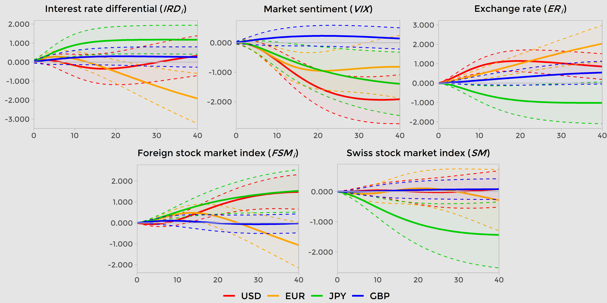
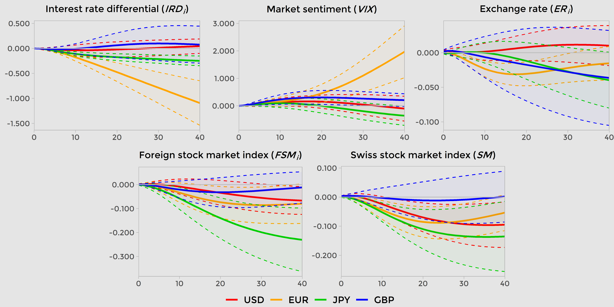

count: false

```{r setup, include=FALSE}
options(htmltools.dir.version = FALSE)
library(dplyr)
library(kableExtra)
library(knitr)
```

```{r xaringan-themer, include = FALSE}
library(xaringanthemer)
style_xaringan()
mono_light(
  link_color = "#64b9d3",
  base_color = "#000000",
  code_inline_color = "#64b9d3",
  header_font_google = google_font("Josefin Sans"),
  text_font_google   = google_font("Montserrat", "300", "300i"),
  code_font_google   = google_font("Source Code Pro"),
  title_slide_background_image = "all-ok.PNG",
  title_slide_background_size = "95%",
  title_slide_background_position = "bottom"
)
```

# Motivation

- International spillovers of negative interest rate policy (NIRP) is a **very recent** strand in the literature (e.g. Arteta, Kose, Stocker and Taskin 2016<sup>1</sup>)

- Twofold interest in the Swiss franc:

  1. In times of turmoil, it is a major **safe haven currency** (overall, **funding currency** of carry trade activities)

  2. Due to the "interest rate bonus" (Kugler and Weder 2002<sup>2</sup>) and the NIRP, the impacts of the Swiss National Bank's actions resonate **far beyond** Switzerland

.smallok[
.footnote[
[1] Arteta, Carlos, Ayhan Kose, Marc Stocker, and Temel Taskin. 2016. “Negative Interest Rate Policies: Sources and Implications.” Policy Research Working Paper Series 7791. The World Bank.

[2] Kugler, Peter, and Beatrice Weder. 2002. “The Puzzle of the Swiss Interest Rate Island: Stylized Facts and a New Interpretation.” Aussenwirtschafhet 57 (01): 49–64.
]
]

- Lack of **robust** empirical papers **criticizing** the carry trade activity

???

> The carry trade is the name of the strategy of going  short  (betting  the  foreign  exchange value will fall) in a low-interest rate currency like  the  Japanese  yen,  while  simultaneously going  long  (betting  the  foreign  exchange value will rise) in a high-interest rate currency like the New Zealand dollar.

> --- Frankel (2008)

---

# What do we do?

In the context of the NIRP in Switzerland...

1. We analyse the **determinants** of the Swiss franc carry trade

  + Financial variables: interest rate differential between Switzerland and major currency, global market sentiment, nominal exchange rates, Swiss stock market index, and major currency stock market index
  
  .highlight[Hypothesis 1] The Swiss franc carry trade is impacted differently by the major currencies
  
--

2. How the carry trade activity in Swiss francs **impacts** the financial variables in the model?

  .highlight[Hypothesis 2] The exchange rate is depreciating with an increased Swiss franc carry trade activity
  
--

3. Analysis setting 

  + Weekly data; December 23, 2014 to September 15, 2020

  + Four major currencies: US dollar, euro, Japanese yen, and British pound

???

Talk about the intuition behind the questions. Notably, the SNB seeks to foster domestic economic growth with the NIRP and the search for a weak Swiss franc, in order to help Swiss firms to compete globally.
---

# What do we find?

1. We analyse the **determinants** of the Swiss franc carry trade

  .highlight[Hypothesis 1] is **partially confirmed**
  
  + Only two mutual results: 
  
  I. Negative impact of the market sentiment shock (US dollar, euro and Japanese yen models)

  II. Positive impact of the US and Japanese stock markets (US dollar and Japanese yen models)
  
--

2. How the carry trade activity in Swiss francs **impact** the financial variables in the model?

  .highlight[Hypothesis 2] **cannot** be confirmed

  + Euro model produces the only statistically significant result with an appreciation of the Swiss franc after an increase in the Swiss franc carry trade activity

---

count: false

class: inverse, center, middle

# Data and SVAR model

---

```{r Table1, echo=FALSE, message=FALSE, warning=FALSE}

df <- data.frame(Variables = c("\\(CT\\)", "\\(VIX\\)", "\\(SM\\)", "\\(ER_i\\)", "\\(IRD_i\\)", "\\(FSM_i\\)"),
                 Text_1 = c("Ratio of short positions over long positions of non-commercial traders",
                            "Market sentiment (CBOE DJIA Volatility Index)",
                            "Domestic stock market: Swiss Market Index ^SSMI",
                            "Nominal exchange rates: USD/CHF, EUR/CHF, CHF/JPY, GBP/CHF",
                            "Interest rate differential using the spot Next London interbank\n offered rate (LIBOR): CHF minus major currency (USD, EUR, JPY, and GBP)",
                            "Foreign stock markets: S&P 500 ^GSPC - USD, EURONEXT 100 ^N100 - EUR, Nikkei 225 ^N225 - JPY, FTSE 100 ^FTSE"),
                 Text_2 = c("CFTC", "FRED", "Yahoo Finance", "Yahoo Finance", "FRED", "Yahoo Finance"))

df %>%
  mutate(
    Variables = cell_spec(Variables, "html", font_size = "medium", escape = F)
  ) %>%
  kable("html", caption = "Table 1. Description of variables", linesep = "", align = "clc", escape = F,
  col.names = c("Variable", "Definition", "Source")) %>%
  kable_styling(full_width = F) %>%
  row_spec(0:0, align = "c") %>%
  row_spec(0, color = "white", background = "black")
```

--

- All variables are in natural logarithms, except the interest rate differentials. 

- Yahoo Finance data was obtained and checked/cleaned with `r  icon::fa_r_project(colour = "#384CB7")` packages `quantmod` and `BatchGetSymbols` 

---

# CFTC data

- Some caveats: 

> I. Bias in the classification of the traders

> II. Trades identified as speculative may not result from carry trades

> III. Only a small proportion of foreign exchange market activity is executed through exchanges (mostly OTC).

> --- Galati, Heath and McGuire (2007)<sup>3</sup>

- Nevertheless, as mentioned by market participants, CFTC data tends to be indicative of the **trend** of carry trade activity (Bank for International Settlements 2015)<sup>4</sup>.

.smallok[
.footnote[
[3] Galati, G., A. Heath and P. McGuire (2007), ‘Evidence of carry trade activity’, *BIS Quarterly Review*.

[4] Bank for International Settlements (2015), *Currency Carry Trades in Latin America*, Bank for International Settlements.
]
]

---

# Econometric model

- Structural vector-autoregressive (SVAR) model with Cholesky identification

  + Ordering: <span style=" font-size: medium;" > $IRD_{i}$ $\rightarrow$ $VIX$ $\rightarrow$ $CT$ $\rightarrow$ $ER_{i}$ $\rightarrow$ $FSM_{i}$ $\rightarrow$ $SM$ </span>

--

- Toda-Yamamoto approach to capture long-term effects (non-stationary variables stay in levels)

```{r Table2, echo=FALSE, message=FALSE, warning=FALSE}

tab2 <- data.frame(Text_0 = c("USD", "EUR", "JPY", "GBP"),
                 Text_1 = c("2", "2", "2", "1"),
                 Text_2 = c("\\(USME\\), \\(IRD^{USD}_{t-3}\\), \\(CT_{t-3}\\), \\(FSM^{USD}_{t-3}\\), \\(SM_{t-3}\\)",
                            "\\(IRD^{EUR}_{t-3}\\), \\(CT_{t-3}\\), \\(ER^{EUR}_{t-3}\\), \\(FSM^{EUR}_{t-3}\\), \\(SM_{t-3}\\)",
                            "\\(NIJPY\\), \\(IRD^{JPY}_{t-3}\\), \\(CT_{t-3}\\), \\(ER^{JPY}_{t-3}\\), \\(FSM^{JPY}_{t-3}\\), \\(SM_{t-3}\\)",
                            "\\(BREXIT\\), \\(CT_{t-2}\\), \\(FSM^{GBP}_{t-2}\\), \\(SM_{t-2}\\)"))


tab2 %>%
  mutate(
    Text_2 = cell_spec(Text_2, "html", font_size = "medium", escape = F)
  ) %>%
  kable("html", caption = "Table 2. Exogenous variables for each model", booktabs = T, escape = F, align = "c", 
  col.names = c("Model", "VAR lag length", "Exogenous variables"), position = "!ht") %>%
  kable_styling(full_width = F) %>%
  row_spec(0:0, align = "c") %>%
  row_spec(0, color = "white", background = "black")
```

<br>
.right[*PDF and slides (ASAP also dataset and Stata do-file):* .highlight[[https://bttomio.github.io](https://bttomio.github.io)]]

---

count: false

class: inverse, center, middle

# Results for the Impulse Response Functions (IRFs)

---

class: center

**Swiss franc carry trade activity is .highlight[impacted]...**

```{r, cache=FALSE, echo=FALSE}

```
.center[.small[Figure 1. Cumulative structural carry trade (*CT*) responses to variables impulses in each model]]

--

```{r Table3, echo=FALSE, message=FALSE, warning=FALSE}

tab3 <- data.frame(Variables = c("\\(IRD_i\\)", "\\(VIX\\)", "\\(ER_i\\)", "\\(FSM_i\\)", "\\(SM\\)"),
                 Text_1 = c("EUR (-)", "EUR (+)", "EUR (+)", "EUR (+, SR)", ""),
                 Text_2 = c("JPY (+)", "JPY (+)", "JPY (-)", "JPY (+)", "JPY (-)"),
                 Text_3 = c("", "USD (+)", "USD (+)", "USD (+)", "")) %>%
  mutate(
    Variables = cell_spec(Variables, "html", font_size = "small", escape = F),
    Text_1 = cell_spec(Text_1, "html", font_size = "small", escape = F),
    Text_2 = cell_spec(Text_2, "html", font_size = "small", escape = F),
    Text_3 = cell_spec(Text_3, "html", font_size = "small", escape = F))

tab3 <- as.data.frame(t(tab3))
colnames(tab3) <- tab3[1,]
tab3 <- tab3[-1,]
rownames(tab3) <- NULL

tab3[1,1] <- cell_spec(tab3[1,1], "html", escape = F, color = "white", background = "red")
tab3[2,1] <- cell_spec(tab3[2,1], "html", escape = F, color = "white", background = "green")
tab3[1:3,2] <- cell_spec(tab3[1:3,2], "html", escape = F, color = "white", background = "green")
tab3[c(1,3),3] <- cell_spec(tab3[c(1,3),3], "html", escape = F, color = "white", background = "green")
tab3[2,3] <- cell_spec(tab3[2,3], "html", escape = F, color = "white", background = "red")
tab3[1:3,4] <- cell_spec(tab3[1:3,4], "html", escape = F, color = "white", background = "green")
tab3[2,5] <- cell_spec(tab3[2,5], "html", escape = F, color = "white", background = "red")

tab3 %>%
  kable("html", escape = F, align = "c",position = "!ht") %>%
  kable_styling(full_width = F) %>%
  row_spec(0:0, align = "c") %>%
  row_spec(0, color = "white", background = "black") %>%
  row_spec(2, background = "#E5E5E5") %>%
  row_spec(1:3, bold = T)
```

---

class: center

**An .highlight[increased] Swiss franc carry trade activity...**

```{r, cache=FALSE, echo=FALSE}

```
.center[.small[Figure 2. Cumulative structural variables responses to carry trade (*CT*) impulses in each model]]

--

```{r Table4, echo=FALSE, message=FALSE, warning=FALSE}

tab4 <- data.frame(Variables = c("\\(IRD_i\\)", "\\(VIX\\)", "\\(ER_i\\)", "\\(FSM_i\\)", "\\(SM\\)"),
                 Text_1 = c("EUR (-)", "EUR (+)", "EUR (-)", "EUR (-)", "EUR (-)"),
                 Text_2 = c("JPY (-)", "", "", "JPY (-)", "JPY (-)"),
                 Text_3 = c("", "", "", "USD (-)", "USD (-)")) %>%
  mutate(
    Variables = cell_spec(Variables, "html", font_size = "small", escape = F),
    Text_1 = cell_spec(Text_1, "html", font_size = "small", escape = F),
    Text_2 = cell_spec(Text_2, "html", font_size = "small", escape = F),
    Text_3 = cell_spec(Text_3, "html", font_size = "small", escape = F))

tab4 <- as.data.frame(t(tab4))
colnames(tab4) <- tab4[1,]
tab4 <- tab4[-1,]
rownames(tab4) <- NULL

tab4[1:2,1] <- cell_spec(tab4[1:2,1], "html", escape = F, color = "white", background = "red")
tab4[1,2] <- cell_spec(tab4[1,2], "html", escape = F, color = "white", background = "green")
tab4[1,3] <- cell_spec(tab4[1,3], "html", escape = F, color = "white", background = "red")
tab4[1:3,4] <- cell_spec(tab4[1:3,4], "html", escape = F, color = "white", background = "red")
tab4[1:3,5] <- cell_spec(tab4[1:3,5], "html", escape = F, color = "white", background = "red")

tab4 %>%
  kable("html", escape = F, align = "c",position = "!ht") %>%
  kable_styling(full_width = F) %>%
  row_spec(0:0, align = "c") %>%
  row_spec(0, color = "white", background = "black") %>%
  row_spec(2, background = "#E5E5E5")%>%
  row_spec(1:3, bold = T)
```

---

count: false

class: inverse, center, middle

# Concluding remarks

---

.large[Contribution]

- The paper extends the carry trade literature by investigating the effects of the Swiss NIRP 

- Four Swiss-major currency models are explored ($, €, ¥, £)

- With an **increased** carry trade activity in Switzerland (due to NIRP), the **CHF** is **appreciating** (€ model) and **financial markets activities** (domestic, abroad) is being **harmed**

--

.large[Policy implications]

- We find evidence of an appreciation of the EURCHF (**drawback** of the NIRP) and an increased systemic risk (VIX and stock market)

- Massive asset-purchasing programs, targeting government bonds in particular, participate in the **reduction** of the “safe asset trap” between bond yields

- Central banks' non-coordinated/cooperative measures could make things **worse** (increased uncertainty generated by the COVID-crisis)

---

count: false

class: inverse, center

<br><br><br><br><br><br><br>

.center[
# Thank you!
`r icon::fa("cog", size = 1, animate = "spin", color = "white")` [`bttomio@furb.br`](bttomio@furb.br)

`r icon::fa("twitter", size = 1, color = "white")` [@bttomio](https://twitter.com/bttomio)
]

<br><br><br><br>Slides created with [`xaringan`](https://github.com/yihui/xaringan) and [`xaringanthemer`](https://github.com/gadenbuie/xaringanthemer).

<br>